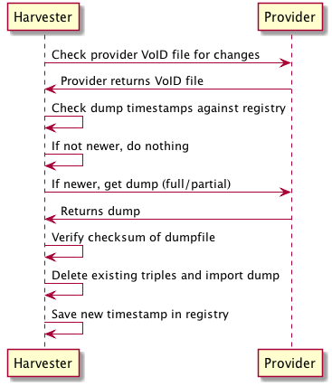

# Harvester Proposal
This proposal describes the GeoLink Harvest System (Harvester)

## Table of Contents

- [Overview](#overview)
- [Harvest Coordination](#harvest-coordination)
- [Importing Process](#importing-process)
- [Registry File](#registry-file)
- [VoID Dataset File](#void-dataset-file)
- [Infrastructure](#infrastructure)


## Overview

The Harvester retrieves RDF dumps of datasets from providers, imports them into its triple store, and makes the combined set of named graphs available for further processing (i.e., co-reference resolution).

Each provider produces one or more dumps of their data and makes those dumps available to the Harvester over publicly-accesible HTTP endpoints. Each provider also creates a [VoID file](http://www.w3.org/TR/void/#void-file) which references a single `void:Dataset` which allows the Harvester to programmatically harvest each of the provider's individual RDF data dumps (e.g., RDF/XML, Turtle files).

The [Registry File](#registry-file) manages what providers the Harvester will harvest. Every minute, the Harvester reads the contents of the [Registry File](#registry-file) and visits each provider's [VoID file](http://www.w3.org/TR/void/#void-file) to determine whether that provider's data dumps have been updated since the last time the Harvester visited the provider. If there have been updates since the last visit, the Harvester retrieves the data dumps and imports them into the triple store (see [Importing Process](#importing-process) for details).



(Figure 1: Schematic outlining the process of visiting a provider to check for new data)

## Harvest Coordination

If a provider wants the Harvester to visit them, whether their content has been updated or not, they just need to update the `dcterms:modified` statement in their VoID File to a newer value.
The Harvester transfers each data dump file to its local file system, imports it, and updates the registry file with the value of the provider's latest `dcterms:modified` statement.

## Importing Process

Each provider's data dumps are stored in per-provider named graphs for isolation and easy further processing.
If a provider produces multiple dump files, they are imported into a single named graph just as if the provider only produced one.

A key property of the importing process is how statements are handled.
Prior to importing each dump file into the provider's named graph, the Harvester parses the dump file and, for each unique subject contained in the dump, deletes all triples from the named graph about that subject.
Once the deletion is done, the dump is then imported completely.

This allows providers to update and/or delete information about subjects and while establishing that a provider cannot delete a subject entirely from their graph but they can remove all statements about that subject.
The implication of this is that, when the Harvester processes a data dump, it is assuming that, for statements in the dump, those statements represent the complete knowledge the provider has about that subject.

### Full vs. Partial Datasets

Each provider may elect to produce dump files that contain either their entire data catalog (Full) or may publish a partial dataset which contains only data that has been updated since the last time the Harvester visited the provider (Partial).
The reason for allowing either form is to accommodate differing needs across providers and also to reduce the amount of unnecessary transferring of files over the network and time spent importing data into the Harvester's triple store.
It is expected that, for many providers' dumps, most triples will stay the same over time and that only a small fraction of triples will be changed or added between Harvester visits.
At least some of the provider dataset are expected to be gigabytes in size and reducing unnecessary network transfers is desirable.
Additionally, because the importing process attempts to delete existing triples, the time the import process takes to run scales with the number of triples in the data dump being imported.

Full vs. Partial dumps are distinguished by the presence of a `void:Feature` triple in the provider's [VoID Dataset File](#void-dataset-file).


## The Registry File

The Registry File is a YAML-formatted file stored in this repository. It is updated manually. For each provider in the registry, there is a name, and two fields: 'modified' and 'void'.

### Field: 'name'

The name value is used as the name of the named graph for the provider and so should be a valid final part of a URL. However, for simplicity's sake, only [a-zA-Z0-9] should be used.

### Field: 'modified'

The modified value is compared with what is found in the `dcterms:modified` statement for the provider's `void:Dataset`. When the Harvester reads the registry file, it attempts to convert whatever is found in this field as a `datetime.datetime`. Examples of valid formats are '2015-10-10' and '2015-12-04 14:25:44.758604'.

### Field: 'void'

The void value is is used by the Harvester to retrieve the provider's VoID File over the Internet. It must be a valid HTTP URI that returns some RDF serialization such as RDF/XML or Turtle. The format of the VoID file is guessed from its extension using the following mappings:

- `*.xml` => RDF/XML
- `*.ttl` => Turtle

### Example

```{yml}
d1lod:
  modified: 2015-10-01
  void: http://lod.dataone.org/void.ttl
```

Adding a new provider would require changing the registry file to:

```{yml}
d1lod:
  modified: 2015-10-01
  void: http://lod.dataone.org/void.ttl
some_provder:
  modified: 2015-11-15
  void: http://example.org/void.ttl
```


## VoID Dataset File

The VoID file describes the data available at a provider and includes at least three pieces of information:

- Whether the dataset is a full or partial dump
- When the dataset was last updated
- The location of at least one dumpfile (datasets may be split across many dump files)

Any additional information may be included in the VoID file but they will not be processed by the Harvester.

For each `void:Dataset` described in a provider's VoID file, the harvest system requires the following properties to do its work (brackets indicate cardinality):

- [1] `rdf:type` `void:Dataset`
  - [1] `dcterms:modified`
  - [1:n] `void:feature`
  - [1:n] `void:dataDump`


### Examples

Provider publishing a full dump of their datasets in Turtle format:

```{ttl}
@prefix void: <http://rdfs.org/ns/void#> .
@prefix xsd: <http://www.w3.org/2001/XMLSchema#> .
@prefix dcterms: <http://purl.org/dc/terms/> .
@prefix : <#> .

:#d1lodfull a void:Dataset ;
  dcterms:title "DataOne" ;
  dcterms:description "A Linked Open Data graph of the holdings in DataOne produced for the GeoLink project." ;
  void:feature <http://www.w3.org/ns/formats/Turtle> ;
  void:feature <http://schema.geolink.org/dev/voc/harvester#FullDump> ;
  void:dataDump <http://lod.dataone.org/dataone.ttl> ;
  dcterms:modified "2015-11-05"^^xsd:date ;
  .
```

Provider publishing their datasets as a series of dump files separated by broad concepts:

```{ttl}
@prefix void: <http://rdfs.org/ns/void#> .
@prefix xsd: <http://www.w3.org/2001/XMLSchema#> .
@prefix dcterms: <http://purl.org/dc/terms/> .
@prefix : <#> .

:#d1lodfull a void:Dataset ;
  dcterms:title "DataOne" ;
  dcterms:description "A Linked Open Data graph of the holdings in DataOne produced for the GeoLink project." ;
  void:feature <http://www.w3.org/ns/formats/Turtle> ;
  void:feature void:feature <http://schema.geolink.org/dev/voc/harvester#FullDump> ;
  dcterms:modified "2015-11-05"^^xsd:date ;
  void:dataDump <http://lod.dataone.org/datasets.ttl> ;
  void:dataDump <http://lod.dataone.org/people> ;
  void:dataDump <http://lod.dataone.org/organizations.ttl> ;
  .
```

Note the use of `<http://lod.dataone.org/glharvest#FullDump>` and `<http://lod.dataone.org/glharvest#PartialDump>`. These are `void:TechnicalFeature`s described as a vocabulary within the GeoLink Schema (not yet made available).

The [VoID spec](http://www.w3.org/TR/void/) describes other properties that may be added to the VoID file such as `foaf:homepage` or `dcterms:publisher`. These properties may be specified in the VoID file but are not specifically needed for the Harvest System.

## Infrastructure

The Harvest System runs on a single virtual machine hosted at UCSB which runs the following pieces of software:

- Triple store: [GraphDB](http://graphdb.ontotext.com/display/GraphDB6/Home) via [Sesame Workbench](http://rdf4j.org/sesame/2.8/docs/articles/workbench.docbook?view)
- Harvester: A custom Python 2.7.10 package
- Queueing system: Python-based [RQ](http://python-rq.org/) queue running [Redis](http://redis.io/)
- SPARQL Endpoint: Either deploy [Virtuoso](virtuoso.openlinksw.com) or simply expose the [Sesame Workbench](http://rdf4j.org/sesame/2.8/docs/articles/workbench.docbook?view)


## What Happens When It Runs

At startup, the Harvest System schedules a number of jobs to be run at specified intervals:

- Update (every 1min): Update the contents of the Harvest System with content from providers
- Export (every 1min): Export the repository (all named graphs combined)
- Status (every 1min): Provides various status updates for debugging purposes


## TODOs

This document is in progress. Some of the action items are listed below:

- Discuss how the queue handles backlogs. For example, if the case arises where it takes four days to process a dump but the provider changes their graph daily and we check for changes daily what do we do?
- Discuss access control issues. It's import that a provider can't push changes to another provider's named graph by changing the contents of their VoID dump file. The fix for this could be as simple as making the registration process fix the location of the VoID with a named graph and checking this at harvest-time.
- The harvest system has to coordinate telling providers that their partial dump has been harvested. Design a solution and include it in the proposal.
